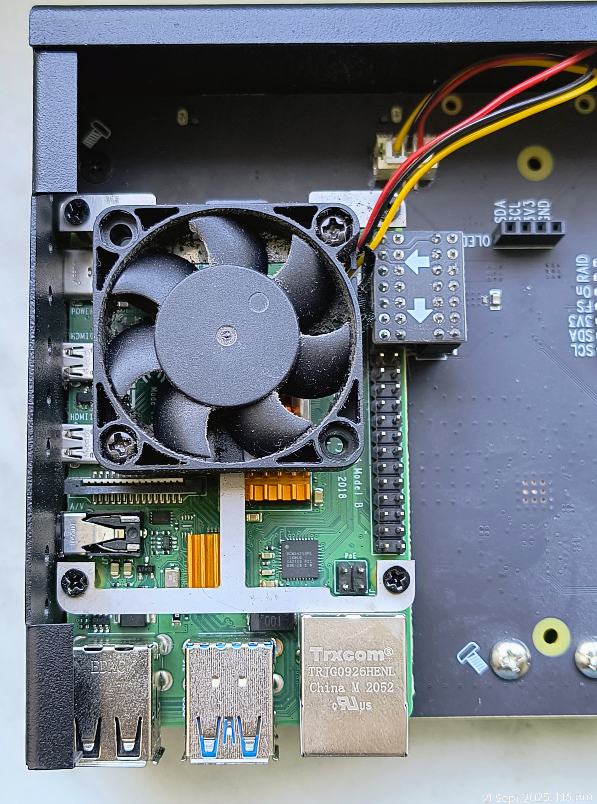
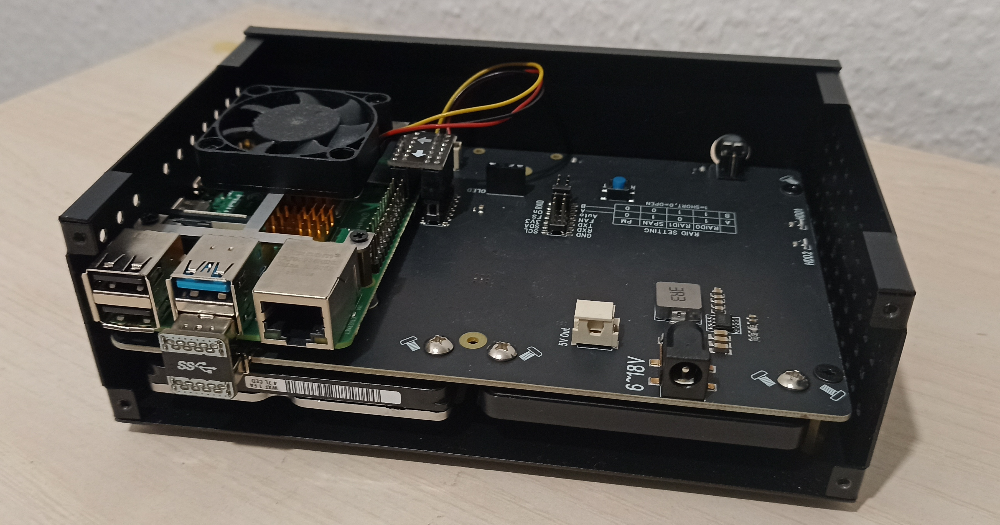

# GPIO PWM Fan Controller

A simple CLI tool to control 3-wire PWM fans on Raspberry Pi.

## My Raspberry Pi Config

<table align="center">
<tr>
  <td>
    <center>
      
    </center>
  </td>
  <td>
    <center>
      
    </center>
  </td>
</tr>
</table>

<table>
<tr>
  <td>Model</td>
  <td>Raspberry Pi 4 Model B Rev 1.4</td>
</tr>
<tr>
  <td>CPU</td>
  <td>BCM2835 (4) @ 1.800GHz</td>
</tr>
<tr>
  <td>Memory</td>
  <td>8 GB</td>
</tr>
<tr>
  <td>OS</td>
  <td>Ubuntu 22.04.2 LTS aarch64</td>
</tr>
<tr>
  <td>Case</td>
  <td>Geekworm NASPi Gemini 2.5 V2.0 Dual 2.5 Inch SATA HDD/SSD</td>
</tr>
</table>

## Usage

```sh
Usage: gpio-pwm-fanctl --pwm-freq=25000 [flags]

A simple CLI tool to control 3-wire PWM fans on Raspberry Pi.

Fan speed mapping (temperature °C → fan speed %):

    80°C  = 100%
    70°C  = 80%
    35°C  = 60%
    0°C   = 40%

Flags:
  -h, --help                 Show context-sensitive help.
      --fan-pin=18           BCM GPIO pin number connected to the fan (must support PWM, e.g. 18 for GPIO18) ($FAN_PIN).
      --temp-file="/sys/class/thermal/thermal_zone0/temp"
                             Path to the CPU temperature file ($TEMP_FILE).
      --pwm-freq=25000       PWM frequency in Hz for the fan (e.g. 25000, 20000) ($PWM_FREQ).
      --delay=2m             Delay between temperature checks (e.g. 30s, 1m) ($DELAY).
      --log.format="json"    Set the output format of the logs. Must be "console" or "json" ($LOG_FORMAT).
      --log.level=INFO       Set the log level. Must be "DEBUG", "INFO", "WARN" or "ERROR" ($LOG_LEVEL).
      --log.add-source       Whether to add source file and line number to log records ($LOG_ADD_SOURCE).
```

## Installation (as a systemd service)

1. Get the binary

   1. Build
      > https://taskfile.dev/

   ```bash
   git clone git@github.com:veerendra2/gpio-pwm-fanctl.git
   task build
   ```

   2. Or download from [latest releases](https://github.com/veerendra2/gpio-pwm-fanctl/releases)

```bash
chmod +x gpio-pwm-fanctl
sudo mv gpio-pwm-fanctl /usr/local/bin/gpio-pwm-fanctl
```

2. Create the systemd service file
   Save the following as `/etc/systemd/system/gpio-pwm-fanctl.service`:

   ```ini
   [Unit]
   Description=GPIO PWM Fan Controller
   After=network.target

   [Service]
   Type=simple
   ExecStart=/usr/local/bin/gpio-pwm-fanctl
   Restart=on-failure
   User=root

   [Install]
   WantedBy=multi-user.target
   ```

   > **Note:** Adjust the `ExecStart` path if your binary is elsewhere.

3. Reload systemd and enable the service

   ```bash
   sudo systemctl daemon-reload
   sudo systemctl enable --now gpio-pwm-fanctl
   ```

4. **Check service status**

   ```bash
   sudo systemctl status gpio-pwm-fanctl
   ```

The service will now start automatically on boot and control your fan with
